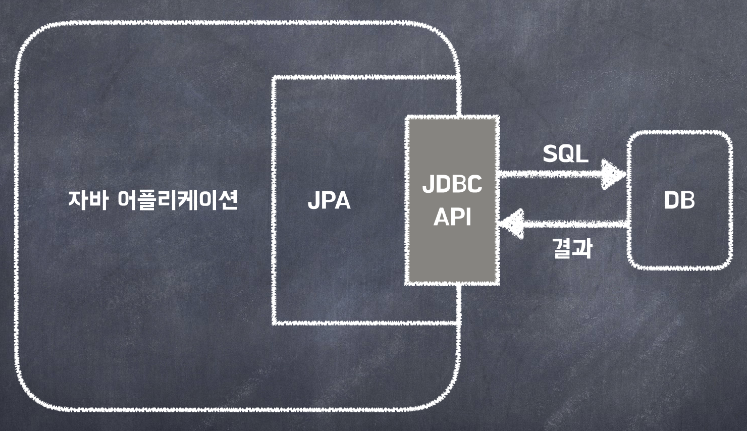

  

## JPA란?

**JPA**(Java Persistence API)란 Java ORM 기술에 대한 API 표준 명세이다.

  

## ORM

**ORM**이란 객체와 테이블을 매핑해서 패러다임의 불일치를 개발자가 대신 해결하는 것이다.

**패러다임의 불일치**: 자바 언어는 객체지향이고 DB는 데이터 중심으로, 패러다임의 불일치가 발생한다.

  

## JDBC

- DB에 접근할 수 있도록 Java에서 제공하는 API이다.
- 쿼리 실행 전, 후 많은 코드를 작성해야 하며 코드를 반복 작성해야 하므로 비효율적이다.

- **따라서 JPA는** JDBC로 처리하는 상당 부분의 코드와 파라미터 설정 및 결과 매핑을 대신 해준다.

  

## JPA 장점과 단점

**장점**

- 반복적인 SQL일을 대신 처리해준다.
- SQL이 아닌 객체 중심으로 개발 가능하다.
- 개발 속도와 유지보수가 높다.

**단점**

- 통계 쿼리처럼 매우 복잡한 SQL을 작성하기엔 적합하지 않다.
- JPA 내부 동작 방식을 이해하기 어렵다.
