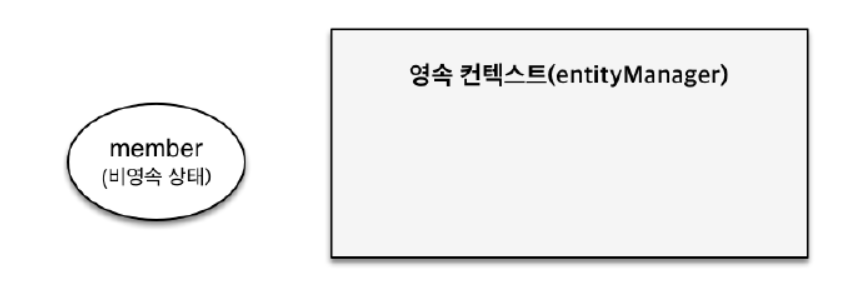
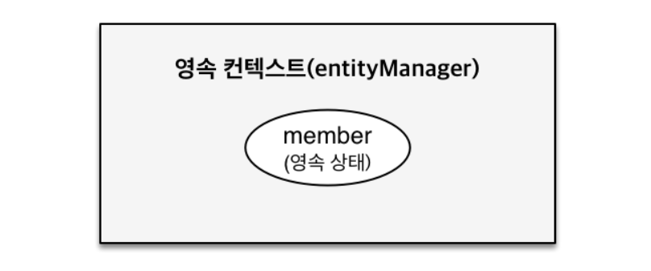

---

# [섹션1] JPA 소개

## JPA란?

**JPA**(Java Persistence API)란 Java ORM 기술에 대한 API 표준 명세이다.

## ORM

**ORM**이란 객체와 테이블을 매핑해서 패러다임의 불일치를 개발자가 대신 해결하는 것이다.

**패러다임의 불일치**: 자바 언어는 객체지향이고 DB는 데이터 중심으로 패러다임의 불일치가 발생한다.

## JDBC


- DB에 접근할 수 있도록 Java에서 제공하는 API이다.
- 쿼리 실행 전, 후 많은 코드를 작성해야 하며 코드를 반복 작성해야 하므로 비효율적이다.

- **따라서 JPA는** JDBC로 처리하는 상당 부분의 코드와 파라미터 설정 및 결과 매핑을 대신 해준다.

## JPA 장점과 단점

**장점**

- 반복적인 SQL일을 대신 처리해준다.
- SQL이 아닌 객체 중심으로 개발 가능하다.
- 개발 속도와 유지보수가 높다.

**단점**

- 통계 쿼리처럼 매우 복잡한 SQL을 작성하기엔 적합하지 않다.
- JPA 내부 동작 방식을 이해하기 어렵다.

---

# 영속성 관리

## 영속성 컨텍스트

**영속성**이란 데이터를 생성한 프로그램의 실행이 종료되더라도 사라지지 않는 데이터의 특성을 의미한다.
**영속성 컨텍스트**는 엔티티를 영구저장하는 환경이다.

- 엔티티 매니저를 통해 영속성 컨텍스트에 접근 가능하다.
- 엔티티 매니저를 생성하면 그 안에 1:1로 영속성 컨텍스트를 생성한다.

## 엔티티 생명주기

### 비영속

- 영속성 컨텍스트와 전혀 관계가 없는 새로운 상태이다.
  

```
// 비영속
Member member = new Member();
member.setId(100L);
member.setName("Hellohaha");
```

JPA에 관계 없이 객체만 생성한 상태에다.

### 영속

- 영속성 컨텍스트에 관리되는 상태이다.
  

```
// 비영속
Member member = new Member();
member.setId(100L);
member.setName("Hellohaha");

//영속
em.persist(member);
```

객체를 영속 컨텍스트에 저장한다.
DB에 저장 되는 것이 아닌 1차 캐시에 저장된다.

### 준영속

- 준영속: 영속성 컨텍스트에 저장되었다가 분리된 생태이다.

### 삭제

- 삭제: 삭제된 상태이다.

```
em.detach(member);
```

영속성 컨텍스트에서 지운다.

```
em.remove(member);
```

실제 DB 삭제를 요청한다.

## 영속성 컨텍스트 장점

### 1차 캐시

### 동일성 보장

### 트랜젝션을 지원하는 쓰기 지연

### 변경 감지

### 지연 로딩
