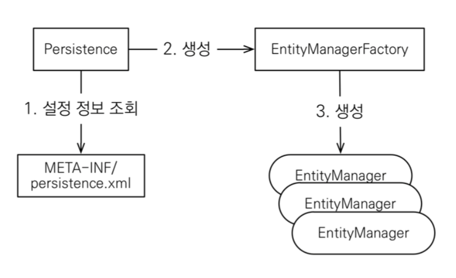

<br/><br/>

## 💻 설치하기

1. H2 데이터 베이스 설치 : 실습용 최고의 데이터 베이스
2. Intellij IDEA 설치: Java 8버전 이상, 메이븐 설정(자바 라이브러리, 빌드 관리)

<br/><br/>

## 📁 JPA 프로젝트 기본 파일

### <span style="color:#BADADF">📄 pom.xml</span>

프로젝트 관리 및 빌드에 필요한 환경설정 등을 기술

```xml
    <project></project>
```

- 프로젝트 정보를 기술한다.

```xml
    <modelVersion>4.0.0</modelVersion>
    <groupId>jpa-basic</groupId>
    <artifactId>ex1-hello-jpa</artifactId>
    <version>1.0.0</version>
```

- `modelVersion`: maven의 pom.xml의 모델 버전이다.
- `groupId`: 프로젝트를 생성한 그룹명으로 제작자와 회사, 단체 등을 식별하기 위한 것이다.
- `artifactId`: 버전 정보를 생략한 파일 이름이다.

```xml
<dependencies>
        <!-- JPA 하이버네이트 -->
        <dependency>
            <groupId>org.hibernate</groupId>
            <artifactId>hibernate-entitymanager</artifactId>
            <version>5.3.10.Final</version>
        </dependency>
        <!-- H2 데이터베이스 -->
        <dependency>
            <groupId>com.h2database</groupId>
            <artifactId>h2</artifactId>
            <version>1.4.199</version>
        </dependency>
</dependencies>
```

- `dependencies`: 라이브러리를 모아 관리하는 곳이다.
- groupId, artifactId은 위의 설명과 동일하다.

단, 본인이 사용하는 spring과 JPA의 하이버네이트와 본인이 사용하는 h2 버전을 <span style="color:#F5B1C8">통일 시키는 것이 좋다.</span>

### <span style="color:#BADADF">📄 persistence.xml</span>

- JPA의 설정파일이다.
- main/resoures에 META-IN/persistence.xml 파일 생성

```xml
<persistence-unit name="hello">
        <properties>
            <!-- 필수 속성 -->
            <property name="javax.persistence.jdbc.driver" value="org.h2.Driver"/>
            <property name="javax.persistence.jdbc.user" value="sa"/>
            <property name="javax.persistence.jdbc.password" value=""/>
            <property name="javax.persistence.jdbc.url" value="jdbc:h2:tcp://localhost/~/test"/>
            <property name="hibernate.dialect" value="org.hibernate.dialect.H2Dialect"/>

            <!-- 옵션 -->
            <property name="hibernate.show_sql" value="true"/>
            <property name="hibernate.format_sql" value="true"/>
            <property name="hibernate.use_sql_comments" value="true"/>
            <!--<property name="hibernate.hbm2ddl.auto" value="create" />-->
        </properties>
    </persistence-unit>
```

- `persistence-unit`: 고유한 이름을 부여한다. EntityManageFactory 생성 시 unit name과 일치해야 한다.
- `jdbc.url`: DB 접속 URL으로, h2 실행 시 url이 일치해야 한다.
- `hibernate.dialect`: DB dialect 설정

- `hibernate.show_sql`: 실행한 sql을 로그로 출력한다.
- `hibernate.format_sql`: 실행한 sql 쿼리문을 정렬한다.
- `hibernate.use_sql_comments`: 쿼리 출력시 주석문도 함께 출력된다.
- `hibernate.hbm2ddl.auto`: <span style="color:#F5B1C8">데이터 베이스 스키마 자동 생성(섹션 4.엔티티 매핑에서 자세히 다룰 예정)</span>

<br/><br/><br/>

## 데이터 베이스 방언

<span style="color:#F5B1C8">JPA는 특정 데이터 베이스에 종속적이지 않다.</span>
따라서 데이터 베이스 방언 클래스(Dialect)를 제공하는데 프로젝트 개발자는 이에 대하여 사용하는 데이터 베이스가 변경되어도 <span style="color:#F5B1C8">방언만 교체하면 쉽게 DB를 변경할 수 있다.</span>

**방언(Dialet) 종류**: MySQL DB, Oracle DB, H2 DB

<br/><br/>

## JPA 구동 방식



1. persistence에서 설정 정보를 읽는다.
2. factory 클래스를 만든다.
3. 필요할 때마다 Entry Manager을 만든다.

<br/><br/>

## 🤔 Entity Manager Factory란?

- **<span style="color:#F5B1C8"> 어플리케이션은 단 하나의 EntityManagerFactory를 가진다.</span>**
- 어플리케이션이 실행하면 생성하고 종료하면 소멸한다.

<br/><br/>

## 🤔 Entity Manager란?

- 엔티티매니저는 영속 컨텍스트에 접근하여 엔티티에 대한 DB 작업을 제공한다.
- 고객에게 요청이 올 때마다 사용하고 바로 버려야 하기 때문에 **<span style="color:#F5B1C8">쓰레드 간에 공유하면 안 된다.</span>**

<br/><br/><br/>

## 객체와 테이블 생성 후 매핑하기

<br/><br/>

<span style="color:#BADADF">📄 Member.java</span>

```java

@Entity // JPA가 인식
public class Member {

    @Id //JPA에게 PK 알려주기
    private Long id;
    private String name;

    public Long getId() {
        return id;
    }
    public void setId(Long id) {
        this.id = id;
    }

    public String getName() {
        return name;
    }

    public void setName(String name) {
        this.name = name;
    }
}
```

<br/><br/>

<span style="color:#BADADF">📄 JpaMain.java</span>

```java
    // Entity manager factory 생성
    EntityManagerFactory emf = Persistence.createEntityManagerFactory("hello");

     // Entity manager 생성
    EntityManager em = emf.createEntityManager();

    // 모든 데이터 변경은 트랜잭션 안에서 실행
    EntityTransaction tx =  em.getTransaction();

    // 트랜잭션 시작
    tx.begin();

    try {
        //code
        ...


        tx.commit; // DB 반영
    } catch (Exception e){

        // try문 에러시 DB에 반영 x
        tx.rollback();
    } finally {
        // 항상 요청이 끝나면 버려주기
        em.close();
    }

    // 버려주기
    emf.close();


```

<span style="color:#BADADF"> 🤔 트랜잭션

- **<span style="color:#F5B1C8">JPA의 모든 데이터 변경(수정, 삭제, 추가 등)은 트랜잭션 안에서 실행되어야 한다.</span>** 따라서 tx.begin 이후 DB에 대한 코드를 작성한다.
- tx.commit 부분에서 실제로 DB에 적용되기 때문에 try문에서 에러가 나면 tx.rollback으로 DB에 반영하지 않을 수 있다.

### 등록

```
Member member = new Member();
member.setId(2L);
member.setName("HelloB");

em.persist(member); //JPA에 멤버 저장
```

### 조회

```
Member findMember = em.find(Member.class, 1L);
```

### 수정

```
findMember.setName("HelloJPA");
```

수정하고 따로 저장 안하고 값만 바꾸면 된다.

### 삭제

```
em.remove(findMember);
```

<br/><br/><br/>

## JPQL

**<span style="color:#F5B1C8">JPA는</spna>** 엔티티 객체를 중심으로 개발하므로 **<span style="color:#F5B1C8">SQL을 사용하면 안된다.</span>**
그러나 SQL을 사용해야 하는 경우가 생기는데 바로 검색 쿼리를 사용해야 할 때이다.
JPA는 엔티티 객체를 중심으로 개발하므로 검색할 때도 테이블을 사용하지 않고 객체를 대상으로 검색해야 한다.
JPA는 SQL을 추상화한 JPQL이라는 객체 지향 쿼리 언어를 제공한다.

- 엔티티 객체를 대상으로 검색하는 쿼리이다.
- **<span style="color:#F5B1C8">JPQL은 SQL을 추상화한 객체 지향 쿼리 언어이다.</span>**
