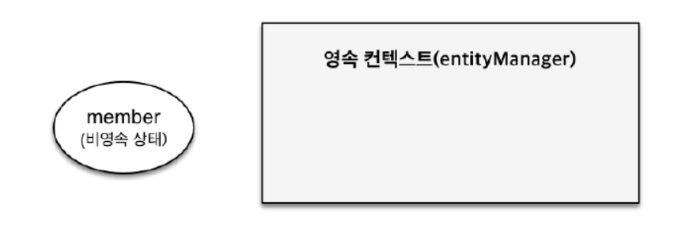
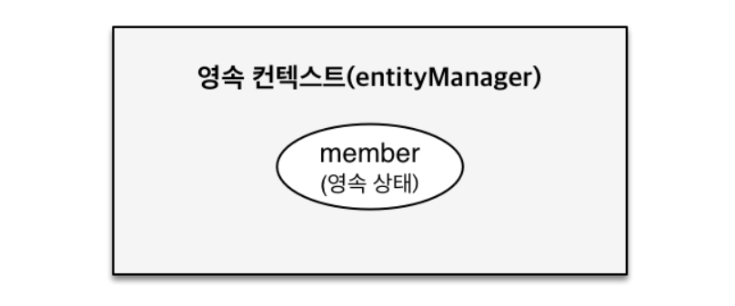
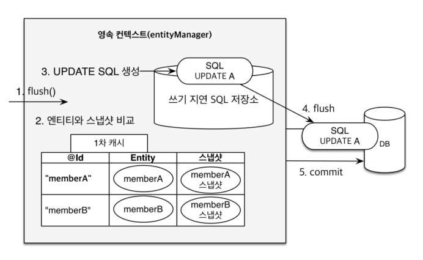

---

# 영속성 관리

## 영속성 컨텍스트

**영속성**이란 데이터를 생성한 프로그램의 실행이 종료되더라도 사라지지 않는 데이터의 특성을 의미한다.
**영속성 컨텍스트**는 엔티티를 영구저장하는 환경이다.

- 엔티티 매니저를 통해 영속성 컨텍스트에 접근 가능하다.
- 엔티티 매니저를 생성하면 그 안에 1:1로 영속성 컨텍스트를 생성한다.

## 엔티티 생명주기

### 비영속

- 영속성 컨텍스트와 전혀 관계가 없는 새로운 상태이다.
  

```
// 비영속
Member member = new Member();
member.setId(100L);
member.setName("Hellohaha");
```

JPA에 관계 없이 객체만 생성한 상태에다.

### 영속

- 영속성 컨텍스트에 관리되는 상태이다.
  

```
// 비영속
Member member = new Member();
member.setId(100L);
member.setName("Hellohaha");

//영속
em.persist(member);
```

객체를 영속 컨텍스트에 저장한다.
DB에 저장 되는 것이 아닌 1차 캐시에 저장된다.

### 준영속

- 준영속: 영속성 컨텍스트에 저장되었다가 분리된 생태이다.
- 준영속 상태로 만드는 방법:
  em.detach(entity): 특정 엔티티만 준영속 상태로 전환한다.
  em.clear(): 영속성 컨텍스트를 완전히 초기화한다.
  em.close(): 영속성 컨텍스트를 종료한다.

### 삭제

- 삭제: 삭제된 상태이다.

```
em.detach(member);
```

영속성 컨텍스트에서 지운다.

```
em.remove(member);
```

실제 DB 삭제를 요청한다.

## 영속성 컨텍스트 장점

### 1차 캐시

1. 조회 시 1차 캐시에 데이터가 있는지 확인 후, 데이터가 있다면 가져온다.
2. 1차 캐시에 데이터가 없다면, 데이터베이스에 데이터를 요청한다.
3. 데이터베이스에서 받은 데이터를 다음에 사용할 수 있도록 1차 캐시에 저장한다.

### 동일성 보장

- 같은 PK값을 가지는 엔티티에 대해서 동일성을 보장해준다.
- 마치 우리가 자바 컬렉션에서 똑같은 객체를 꺼내는 것과 동일한데, 이는 1차 캐시가 있기에 가능한 일이다.

### 트랜젝션을 지원하는 쓰기 지연 SQL 저장소

```
// Entity manager factory 생성
EntityManagerFactory emf = Persistence.createEntityManagerFactory("hello");

// Entity manager 생성
EntityManager em = emf.createEntityManager();

EntityTransaction tx =  em.getTransaction();

// 트랜잭션 시작
tx.begin();
```

```
em.persist(member);
```

여기까지 INSERT SQL을 데이터 베이스에 보내지 않고 "지연 SQL 저장소"에 모아둔다.

```
tx.commit();
```

커밋하는 순간 모아두었던 INSERT SQL을 데이터베이스에 보낸다.

### 변경 감지(수정)

```
// 영속 엔티티 조회
Member findMember = em.find(Member.class, 1L);

// 영속 엔티티 데이터 수정
findMember.setName("HelloJPA");

// 커밋
tx.commit();

```

em.update(memner) 코드가 있어야 하지 않을까? 결론적으론 자동으로 바뀌기 때문에 사용하면 안된다.



**스냅샷**: 최초로 들어온 상태

엔티티와 스냅샷을 비교하여 바뀐 부분이 있으면 쿼리를 업데이트하고 commit한다.

## 플러시

- 영속성 컨텍스트 변경 사항과 DB를 맞추는 작업이다.
- 영속성 컨텍스트에 있는 쓰기 지연 SQL 저장소의 쿼리를 DB에 전송한다.
- 보통 commit될 때 플러시가 발생한다.
- 영속성 컨텍스트를 비우지 않고 변경내용을 DB에 반영하는 과정이다.

### 플러시하는 방법

- em.flush(): 직접 호출
- 트랜잭션 커밋: 플러시 자동 호출
- JPQL 쿼리 실행: 플러시 자동 호출

### 플러시 모드 옵션

- FlushModeType.AUTO: 커밋이나 쿼리를 실행할 때 기본값
- FlusModeType.COMMIT: commit할 때에만 flush
