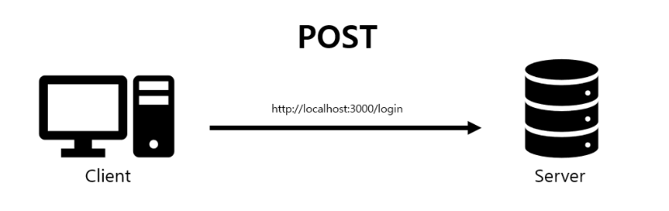

  

## HTTP란?

**HTTP** (ypertext Transfer Protocol)란 하이퍼텍스트 전송 규약으로 Web-Client와 Web-Server간 데이터를 전송하는 프로토콜이다.

GET메소드와 POST메소드는 HTTP 프로토콜에서 데이터 전송을 위해 지원하는 7가지 메소드 중 일부이다.

  

## GET, POST란?

웹 서비스 개발에 주로 사용하는 메서드이다.
사용자가 URL을 브라우저 주소창에 작성하고 엔터를 누르면 원하는 웹사이트가 나온다. 겉으로 보기엔 단순해 보일지라도 내부적인 처리들이 있다.

그 내부적인 처리에서 클라이언트가 서버에게 웹페이지를 보여달라 말하는 것을 **요청** 이라 부르고, 서버가 클라이언트에게 요청받은 것에 대한 대답으로 웹페이지 내용을 표현하기 위해 html 문서로 주는 것을 **응답** 이라 부른다.

우리는 GET과 POST를 통해 요청과 응답을 받을 수 있다.

  

## HTTP 패킷이란?

클라이언트가 서버로 **요청** 을 했을 때 보내는 데이터를 HTTP 패킷이라 한다.

`HTTP`: HTTP 프로토콜 사용
`패킷`: 인터넷을 통해 보내는 데이터

HTTP패킷의 구조는 크게 헤더 와 바디 로 나누어진다.

`헤더`: 7가지 메소드 방식 중 무엇을 사용했는지, 클라이언트 정보, 브라우저 정보, 접속할 URL 등과 같은 클라이언트 정보를 담는다.

`바디`: 어떠한 메소드 방식을 사용하였는지에 따라 Body 영역의 사용 유무 및 사용 방법이 달라진다.

  
  

## 📕 GET

GET은 서버에서 어떤 데이터를 가져와서 보여줄 때 사용한다.  즉, 어떤 값이나 내용, 상태 등을 바꾸지 않는 경우에 사용한다.

### 사용방법

GET은 클라이언트의 데이터를 URL 뒤에 붙여서 보낸다.

`www.example.com?param1=value1&param2=value2 `

- `?`: URL 뒤에 "?" 마크를 통해 URL 끝을 알리면서 데이터 표현의 시작점을 알린다.
- 데이터는 Key와 Value 쌍으로 넣어야 한다.
- `&`: 2개 이상의 Key - Value 데이터를 보낼때는 &마크로 구분해준다.
- URL에 데이터를 넣어 전송하기 때문에 body가 빈상태로 보내진다.

간단한 데이터를 넣도록 설계되어 대용량 데이터 전송을 하기에는 제약사항이 있다.
GET방식은 캐싱 으로 인해 정보를 다시 접근할때 빠르게 가져올 수 있어 POST방식 보다는 빠르다.

  
  

## 📕 POST

post는 서버상의 데이터 값이나 상태를 바꾸기 위해서 사용한다. 즉, POST 방식은 GET 방식과 달리 데이터 전송을 기반으로 한 요청 메서드이다.

POST 방식은 데이터들이 URL에 표시되지 않고 HTTP 패킷 Body에 담겨 서버로 데이터가 전송된다.
따라서 Body영역 데이터 타입을 Header Content-Type에 명시를 해줘야 한다.

=> POST방식은 GET방식과는 달리 보내는 데이터를 URL를 통해 볼 수 없어 보안적으로 안전하다곤 하지만 다른 툴을 사용하여 POST영역의 데이터를 확인이 가능하기 때문에 안심해서는 안된다.
